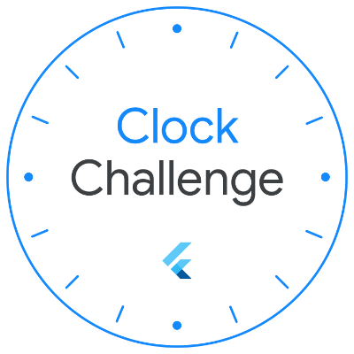
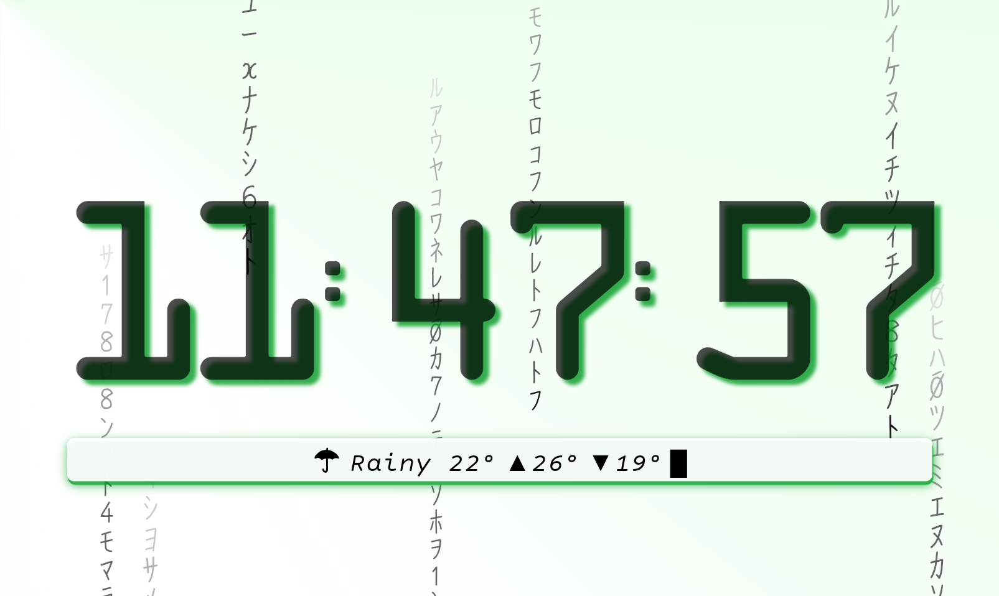

# Digital Rain Clock

This clock face app was designed for the [Flutter Clock challenge](https://flutter.dev/clock). 

The app runs on both Android and iOS, though most of the testing and tweaking was done on Android devices.

Note that the app has not been tested on smart clock hardware or with Android Things OS, which may impose stricter performance constraints.

Refer to [digital\_rain\_clock/lib/widgets/digital_rain.dart](./digital_rain_clock/lib/widgets/digital_rain.dart) for one of the key constants that may be tweaked for performance.

### Dark

### Light

## License

See the [LICENSE.md](./LICENSE.md) file for license rights and limitations.
